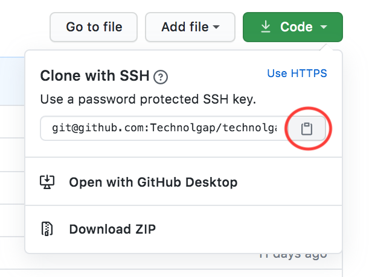

# Technolgap
> The official Technolgap Website for the 2020-2021 school year. The website provides information about Technolgap, events, the executive team, and social media. In addition, visitors can ask to join the private Slack and ask questions. 

This is a [Next.js](https://nextjs.org/) project bootstrapped with [`create-next-app`](https://github.com/vercel/next.js/tree/canary/packages/create-next-app).

## Suggested Knowledge Prerequistes  
* HTML
* CSS 
* JavaScript
* Some idea of NextJS (ideally)
* Some idea of web development (ideally)

## Technolgy Requirements 
* Node (Latest Version)

## Installation (via command line)
Feel free to use Github Desktop (or other GUIs for version control).

0. Go to the Technolgap repistory, click on `Code` and click on the button that's circled below. 



1. Clone this project your terminal using the command below to the directory (ex/ Desktop, Computer) where you want to save this project.

```
git clone [fill this with what you copied from step 0]
```

2. Install Node (https://nodejs.org/en/download/) and SASS (https://sass-lang.com/install) if you don't have it. 

3. Go to the directory where you saved the code and to the folder `technolgap-website` and run the following command. 

`npm install` 

Note: If you get an error in this step, you may have to delete the `node_modules` folde and run this command again. 

4. You can run the local version of the website locally using `npm` or `yarn` 
 
```bash
npm run dev
# or
yarn dev
```
5. Open [http://localhost:3000](http://localhost:3000) with your browser to see the result. Hopefully, you can see the latest version

## Contribution
1. Find issue(s) to work on and assign yourself to them. 

2. Create a new branch with the following command (or use Github GUI):

```
git checkout -b `initials/general-idea-of-your-ticket

```

For example, I'm working on the executive gallery so this would be the name of my branch.

```
git checkout -b `mv/create-executive-gallery

```

3. Type `git branch` to make sure your in the correct branch.

4. You should be ready to go. Most of the work will be editing the folder of your respective component(s). More details on this later.  

## Resources 

To learn more about the technologies used in this project, take a look at the following resources:

### NextJS
- [Next.js Documentation](https://nextjs.org/docs) - learn about Next.js features and API.
- [Learn Next.js](https://nextjs.org/learn) - an interactive Next.js tutorial.
- [the Next.js GitHub repository](https://github.com/vercel/next.js/) - original repo.

### HTML, CSS, JavaScript
- [w3cSchools](https://www.w3schools.com/)

## Deployment 
We are using Heroku to deploy 

The easiest way to deploy your Next.js app is to use the [Vercel Platform](https://vercel.com/import?utm_medium=default-template&filter=next.js&utm_source=create-next-app&utm_campaign=create-next-app-readme) from the creators of Next.js.

Check out our [Next.js deployment documentation](https://nextjs.org/docs/deployment) for more details.

## Commands
Go to the package.json file to learn more about what commands are available.